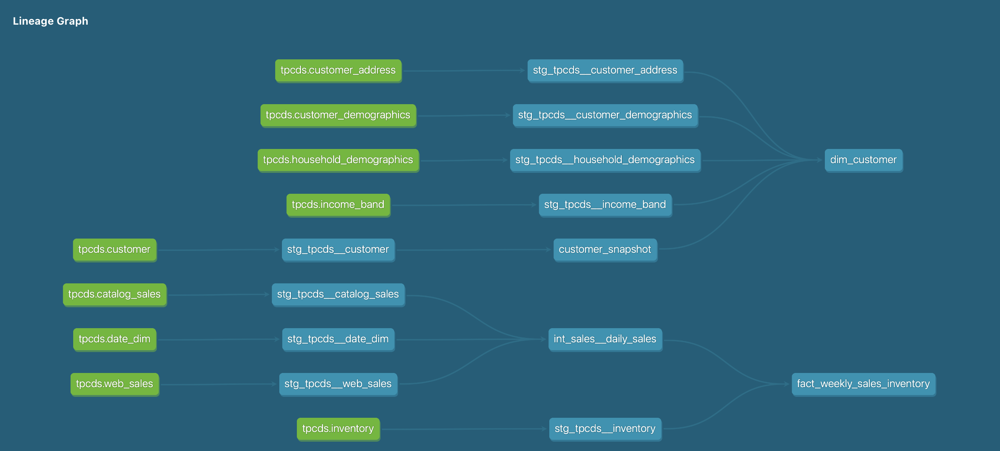
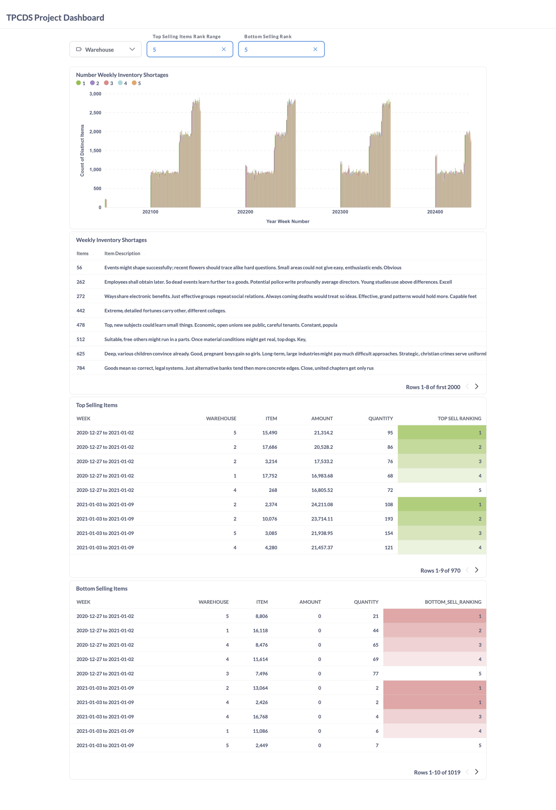

# TPCDS Data Pipeline
An end-to-end, learning-based data engineering project.

## Description
This project uses is the final project for Phase 1 of WeCloudData's Data Engineering Bootcamp. It uses a sample dataset, TPCDS, to build an ELT process and result in a simple BI dashboard. The source data is in two locations: 1. An AWS Postgres RDS, and 2. A csv in an AWS S3 bucket. The data is transferred to Snowflake using AirByte and an AWS Lambda function. The data is transformed using DBT, and is visualized using MetaBase. 

AirByte, DBT, and MetaBase are all set up on AWS EC2 instances. 

![Project Summary][def]

[def]: images/TPCDS_Pipeline_Project_Summary.png

## Contents
1. Dimensional Model: 
    - raw_tables_schema: Excel sheet with structre of raw OLTP tables from Postgres & inventory csv from S3
    - dimensional_model: Excel sheet with the final OLAP tables, following the requirements of the project

2. lambda-layer: the shell script that installs the dependencies needed for the Lambda function

3. lambda-script: the Python code that defines the Lambda Function to move the csv from an S3 bucket to Snowflake

4. DBT: the files that perform the data transformation within Snowflake

5. Images

## Instructions
1. Infrastructure
    - Launch three AWS EC2 instances and install the following programs: DBT, Metabase, Airbyte
    - Establish Snowflake account

2. Extract & Load
    - Airbyte to transfer fact sales tables & customer dim tables
        - Connect Airbyte to source: Postgres RDS and destination: Snowflake
        - Configure and schedule data transfer
    - Lambda function to transfer Inventory csv
        - Create and load Lambda layer to AWS. [See lambda layer README](./lambda-layer/README.md)
        - Creat Lambda function and attach layer. [See lambda layer README](./lambda-script/README.md)

3. Transform
    - The end goal is to create a dimensional model that combines the customer dim tables into a single table and the fact sales and fact inventory tables into a single table that measures weeks supply and flags low stock items
        - Customer Dim will be designed as a SCD Type 2 table

        
    
    - The SQL files, including testing and schedueling, are within the [Snowflake_ETL directory](./Dimensional_Model/Snowflake_ETL/). These are for demonstration purposes. It is reccomended to use the following method.

    - Copy the contents of [DBT project](./DBT/ae_project/) into a DBT project. Connect DBT to Snowflake, and do DBT run.

4. Reporting
    - Metabase is used to build a basic dashboard. Connect Metabase (installed in EC2 instance) to Snowflake. The following dashboard was created for final BI visualizations.

    